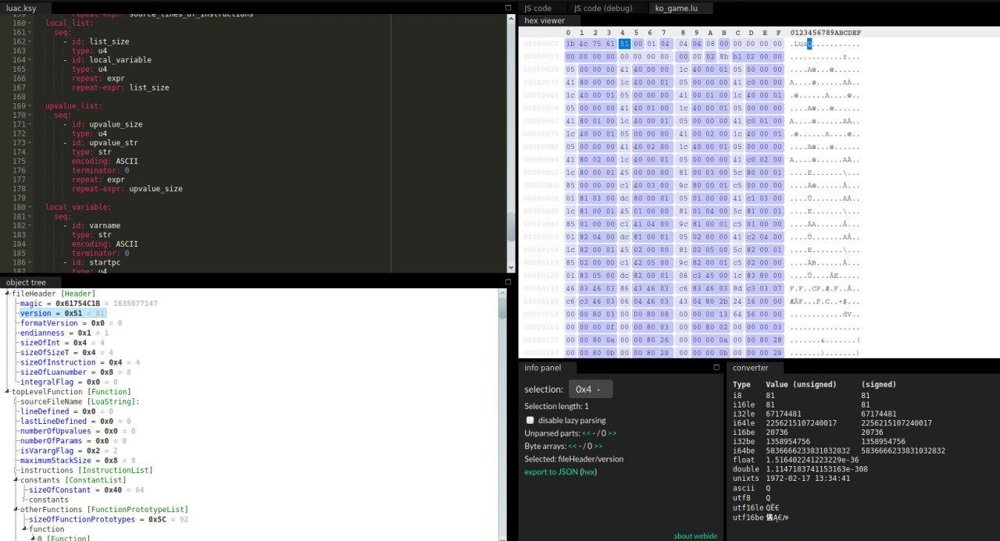
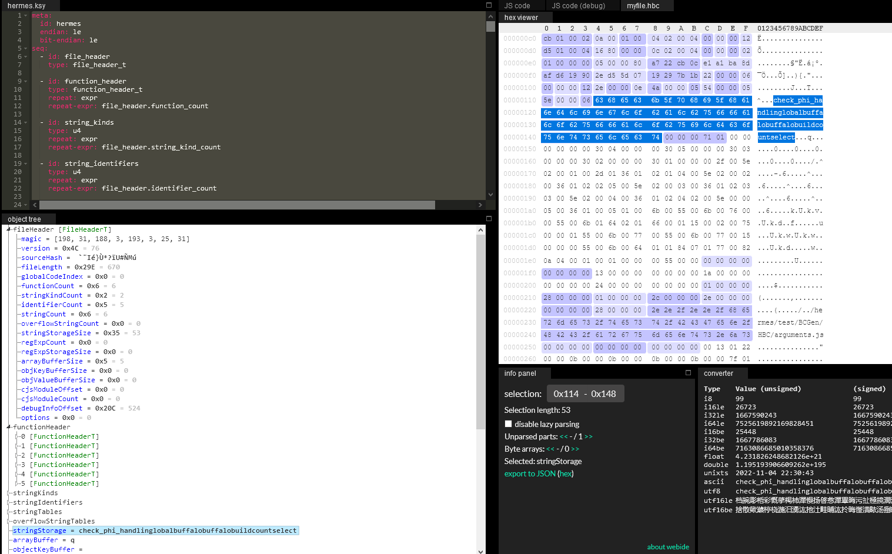

# Kaitai struct files

kaitai struct|filetype| example file |
--|--|--
[luac.ksy](luac.ksy)|[lua 5.1 bytecode](http://luaforge.net/docman/83/98/ANoFrillsIntroToLua51VMInstructions.pdf)|[ko_game.lua](ko_game.lua)
[hbc.ksy](hbc.ksy)|[hermes bytecode](https://github.com/facebook/hermes/blob/master/include/hermes/BCGen/HBC/BytecodeFileFormat.h)|[myfile.hbc](myfile.hbc)

## Web IDE Examples

Lua 5.1

Hermes 

