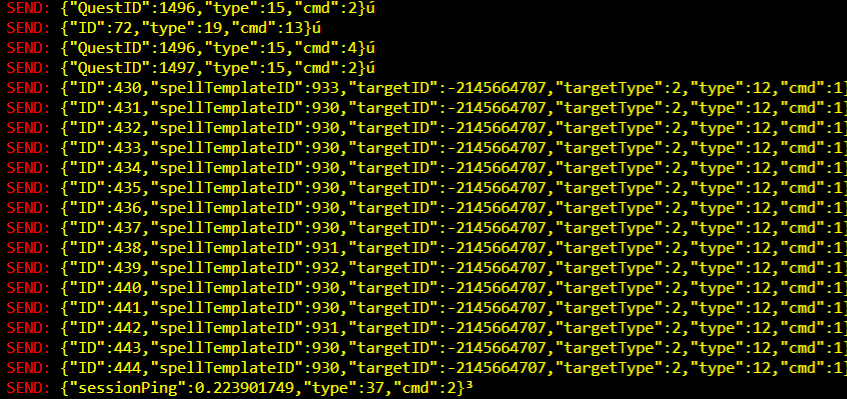

Output of frida script :




Usage: `npm run watch && frida "AQ3D.exe" -l _agent.js`

### Encryption of packets

xor with 250,158,179
```java
private static void EncryptDecrypt(byte[] data)
	{
		byte[] array = new byte[]
		{
			250,
			158,
			179
		};
		for (int i = 0; i < data.Length; i++)
		{
			if (data[i] != array[i % array.Length])
			{
				data[i] ^= array[i % array.Length];
			}
		}
	}
```

Merging means crafting.

### REQUEST

|Name|Cmd|Type|Parameters/Description
|---|---|---|---|
|AdWatch   |   |35   |
|AllBankItems   |4   |32   |List<int> requestedids   |
|AreaJoin   |1   |7   |int id, bool b = false   |
|AreaList   |3   |7   |   |
|BankItems   |1   |32   |(int requestedID   |
|BankPurchase   |3   |32   |string name, byte index, bool value   |
|BitFlagUpdate   |9   |17   |   |
|ChannelJoin   |1   |6   |
|Chat   |   |4   |
|Chat   |1   |4   |SetPublicMessage(int channelID, string msg) |
|Chat   |2   |4   |SetWhisper(string recipient, string msg) |
|ClassAdd   |1   |26   |   |
|ClassEquip   |2   |26   |   |
|Cmd   |   |9   |   |
|Combat   |0   |12   |Cast   |
|Combat   |1   |12   |Trigger   |
|Combat   |2   |12   |Cancel   |
|CrossSkillEquip   |3   |26   |   |
|Customize   |11   |17   |   |
|Debug   |   |22   |   |
|Disconnect   |1   |30   |   |
|DuelForfeit   |7   |20   |   |
|DustLootBoxItem   |11   |10   |   |
|EffectRemove   |9   |12   | RequestEffectRemove(int effectID)  |
|Emote   |   |21   |StateEmote.Enum   |
|EndTransfer   |   |33   |   |
|EntityGender   |24   |17   |   |
|EntityLoadBadges   |17   |18   |   |
|EntityPortaitUpdate   |16   |17   |int portrait   |
|EntityTitleUpdate   |17   |17   | int title  |
|EntityTransferMap   |14   |17   | int mapID, int cellID, int spawnID  |
|Friend   |1   |29   |   |
|FriendAdd   |2   |29   |   |
|FriendDelete   |3   |29   |   |
|FriendList   |4   |29   |   |
|FriendSyncIgnore   |   |24   |   |
|GetChatCommands   |5   |9   |   |
|Goto   |6   |29   |   |
|IATransferPad   |1   |19   |   |
|DailyReward   |10   |10   |   |
|ItemEquip   |1   |10   |   |
|ItemRemove   |4   |10   |   |
|ItemTransfer   |2   |32   |(int id, int from, int to   |
|ItemUnequip   |2   | 10  |   |
| ItemUse  |6   |10   |int charItemID   |
|Login   |3   |   |   |
|LootItem   |3   |16   |int LootID, int ItemID, int Qty = 1|
|MachineCast   |6   |19   |int id   |
|MachineClick   |3   |19   |int id   |
|MachineCollision |13   |19   | int id    |
|MachineResourceCollect   | 16  |19   |int machineID, int primaryItemID, int rareItemID   |
|MachineResourceDrop   |18   |19   | int machineID  |
|MachineResourceTrigger   |22   |19   |  int machineID |
| MachineTrigger  |11   |19   |int id   |
|Merge   |1   |28   |   |
|MergeBuyOut   |4   |28   |   |
|MergeClaim   |3   |28   |   |
|MergeShopLoad  |  2 |28   |   |
|MergeSpeedup   |  5 |28   |   |
|Movement   |  1 | 1  |   |
|Movement   |  1 | 2  |rotation   |
|Movement   |  1 | 4  |jump   |
|NPCDialogueEnD   | 4  |18   |   |
| NPCDialogueStart  |  3  |18   |   |
| OpenLootBox  |9   |10   |   |
| PartyGoto  |  7 |31   |   |
|PartyInvite   |1   |31   |   |
|PartyJoin  |2   |31   |   |
| PartyPromote  | 4  |31   |   |
| PartyRemove  |3   |31   |   |
| PetInteract  |25   |17   |   |
|Ping   |1   |37   |   |
| PingSession  |  2 |37   |   |
| PlayerRespawn  |4   |17   |   |
| PvPDuelAccept  | 3  |20   |   |
| PvPDuelChallenge  |2   |20   |   |
|PvPToggle   |1   |20   |   |
|QuestAbandon   |3   | 15 |   |
|QuestAccept   | 2  |15   |   |
|QuestComplete   |4   |15   |   |
|QuestLoad   | 1  |  15 |   |
|Report   |   | 23  |   |
| ReportError  | 3  |27   |   |
|ShopLoad   |3   |11   |   |
|Summon   |5   | 29  |   |
|TimedChoice   | 2  | 36  |   |
| TradeBuy  | 1  |  11 |   |
|TradeSell   | 2  |11   |   |
|VoteKickChoice   |9   |31   |   |

### RESPONSE

|Name|Cmd|Type|Parameters/Description
|---|---|---|---|
|AdminQSSe   |1   |34   |
|AdWatch   |   |35   |
|AFK   |22   |17  |
|AllBankItems   |4   |32   |List<int> requestedids   |
|AreaJoin   |1   |7   |int id, bool b = false   |
|AreaList   |3   |7   |   |
|BankItems   |1   |32   |(int requestedID   |
|BankPurchase   |3   |32   |string name, byte index, bool value   |
|BitFlagUpdate   |9   |17   |   |
|ChannelJoin   |1   |6   |
|Chat   |   |4   |
|Chat   |1   |4   |SetPublicMessage(int channelID, string msg) |
|Chat   |2   |4   |SetWhisper(string recipient, string msg) |
|ClassAdd   |1   |26   |   |
|ClassEquip   |2   |26   |   |
|Cmd   |   |9   |   |
|Combat   |0   |12   |Cast   |
|Combat   |1   |12   |Trigger   |
|Combat   |2   |12   |Cancel   |
|CrossSkillEquip   |3   |26   |   |
|Customize   |11   |17   |   |
|Debug   |   |22   |   |
|Disconnect   |1   |30   |   |
|DuelForfeit   |7   |20   |   |
|DustLootBoxItem   |11   |10   |   |
|EffectRemove   |9   |12   | RequestEffectRemove(int effectID)  |
|Emote   |   |21   |StateEmote.Enum   |
|EndTransfer   |   |33   |   |
|EntityGender   |24   |17   |   |
|EntityLoadBadges   |17   |18   |   |
|EntityPortaitUpdate   |16   |17   |int portrait   |
|EntityTitleUpdate   |17   |17   | int title  |
|EntityTransferMap   |14   |17   | int mapID, int cellID, int spawnID  |
|Friend   |1   |29   |   |
|FriendAdd   |2   |29   |   |
|FriendDelete   |3   |29   |   |
|FriendList   |4   |29   |   |
|FriendSyncIgnore   |   |24   |   |
|GetChatCommands   |5   |9   |   |
|Goto   |6   |29   |   |
|IATransferPad   |1   |19   |   |
|DailyReward   |10   |10   |   |
|ItemEquip   |1   |10   |   |
|ItemRemove   |4   |10   |   |
|ItemTransfer   |2   |32   |(int id, int from, int to   |
|ItemUnequip   |2   | 10  |   |
| ItemUse  |6   |10   |int charItemID   |
|Login   |3   |   |   |
|LootItem   |3   |16   |int LootID, int ItemID, int Qty = 1|
|MachineCast   |6   |19   |int id   |
|MachineClick   |3   |19   |int id   |
|MachineCollision |13   |19   | int id    |
|MachineResourceCollect   | 16  |19   |int machineID, int primaryItemID, int rareItemID   |
|MachineResourceDrop   |18   |19   | int machineID  |
|MachineResourceTrigger   |22   |19   |  int machineID |
| MachineTrigger  |11   |19   |int id   |
|Merge   |1   |28   |   |
|MergeBuyOut   |4   |28   |   |
|MergeClaim   |3   |28   |   |
|MergeShopLoad  |  2 |28   |   |
|MergeSpeedup   |  5 |28   |   |
|Movement   |  1 | 1  |   |
|Movement   |  1 | 2  |rotation   |
|Movement   |  1 | 4  |jump   |
|NPCDialogueEnD   | 4  |18   |   |
| NPCDialogueStart  |  3  |18   |   |
| OpenLootBox  |9   |10   |   |
| PartyGoto  |  7 |31   |   |
|PartyInvite   |1   |31   |   |
|PartyJoin  |2   |31   |   |
| PartyPromote  | 4  |31   |   |
| PartyRemove  |3   |31   |   |
| PetInteract  |25   |17   |   |
|Ping   |1   |37   |   |
| PingSession  |  2 |37   |   |
| PlayerRespawn  |4   |17   |   |
| PvPDuelAccept  | 3  |20   |   |
| PvPDuelChallenge  |2   |20   |   |
|PvPToggle   |1   |20   |   |
|QuestAbandon   |3   | 15 |   |
|QuestAccept   | 2  |15   |   |
|QuestComplete   |4   |15   |   |
|QuestLoad   | 1  |  15 |   |
|Report   |   | 23  |   |
| ReportError  | 3  |27   |   |
|ShopLoad   |3   |11   |   |
|Summon   |5   | 29  |   |
|TimedChoice   | 2  | 36  |   |
| TradeBuy  | 1  |  11 |   |
|TradeSell   | 2  |11   |   |
|VoteKickChoice   |9   |31   |   |
