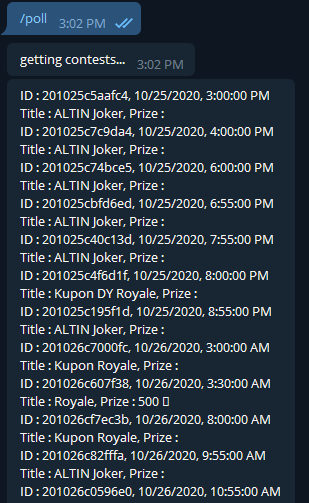
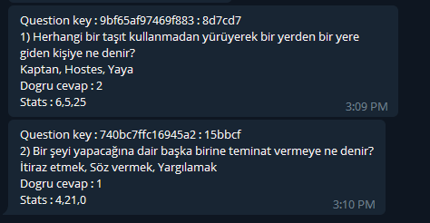

## Oynakazan bot

Create telegram bot and get Auth token from [android app](https://play.google.com/store/apps/details?id=com.oynakazanapp.android)

- start with `node oynakazan_ws.js`
- type `/poll` to the bot on telegram

Features:
- Get all contests
- Auto connect to contests
- Send questions and answers to bot channel.

Contests

Answers

