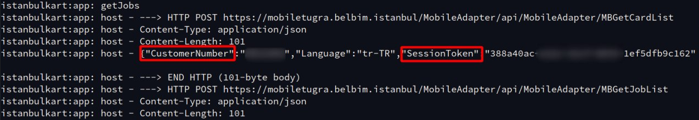

# Proxmark lua scripts


## hf_istanbulkart.lua

You need to get `CustomerNumber` and `SessionToken` from [android app](https://play.google.com/store/apps/details?id=com.belbim.istanbulkart&hl=tr) 

How ?
- Adb logcat
- Open application, login
- grep istanbulkart



### lua

To able to get 3rd party lua scripts which is:
```lua
-- External libs -- 
local json = require('json') -- parse json
local requests = require("requests") -- http requests
local inspect = require("inspect") -- print json
```
- First of all install these libraries with luarocks. Then compile proxmark from source, so pm3 uses your local lua. 

- Then put [hf_istanbulkart.lua](hf_istanbulkart.lua) to proxmark3/client/luascripts/ folder. 

- Run pm3 and `script run hf_istanbulkart -c XXXXXXX -s 388a40ac-XXXX-XXXX-XXX-1ef5dfb9c162`

Arguments : 
```
    -c              Customer number
    -s              Session key
    -d              Debug mode
```
Example run:
```
[usb] pm3 --> script run hf_istanbulkart -c XXXXXXX -s 388a40ac-XXXX-XXXX-XXX-1ef5dfb9c162
[+] executing lua ~/proxmark3/client/luascripts/hf_istanbulkart.lua
[+] args '-c XXXXXXX -s 388a40ac-XXXX-XXXX-XXX-1ef5dfb9c162'
[~] Connected to card, uid = 04253DXXXXXXX0
####### STEP-1 : Create transaction #######
[~] Got transaction id from server : 17XXXXXXXXX
####### STEP-2 : Send card info and auth response server #######
>> 905A00000342220100
<< 9100
>> 9060000000
<< 0401010100180591AF
>> 90AF000000
<< 0401010104180591AF
>> 90AF000000
<< 04253DD29E5580B90C174D2032179100
>> 90BD0000070100000020000000
<< 400102001204180A1C1B1204180A1C1BB8CA3A9D61C2002202006542696C65749100
>> 90F50000010200
<< 000121E24000009100
>> 90F50000010600
<< 010021338000009100
>> 900A0000010200
<< 83E7F6F29F189B2E91AF
[~] Card auth response 83E7F6F29F189B2E91AF , sending it to server
####### STEP-3 : Auth token response from server#######
[~] Got token from server, sending it to card 90AF0000104E0D6FB80692368F26B9C8BD909737A300
####### STEP-4 : Get final auth token #######
>> 90AF0000104E0D6FB80692368F26B9C8BD909737A300
<< 802AABF4897F376C9100
[~] Sending final token to server 802AABF4897F376C9100
######## STEP-6 : Read a lot of data from card ########
>> 90BD0000070100000020000000
<< 400102001204180A1C1B1204180A1C1BB8CA3A9D61C2002202006542696C657491FE820C9100
>> 90BD0000070200000032000000
<< 637060017396598500000000000000000000000000000000000000000000000000000000000000000000000000000000000047E1C5CD9100
>> 90BD000007023200000E000000
<< 000000000000000000000000000065FDFB179100
>> 906C0000010300
<< 04010000372EB8619100
>> 90BD0000070400000032000000
<< 00000000000000000000000000000000000000000000000000000000000000000000000000000000000000000000000000002E170C419100
>> 90BD000007043200002E000000
<< 00000000000000000000000000000000000000000000000000000000000000000000000000000000000000000000A48D6F619100
>> 90BD0000070600000032000000
<< 0000000000000000000000000000020A0000000200050000050014061207352678A3001614000000000000140612073526019100
>> 90BD0000070632000032000000
<< A3001871C1470000002C554E4C2D554E4C001614000000000000005E010000000000000000000000000001000000000000009100
>> 90BD000007066400001C000000
<< 000000000000010101000000000000000000000000000000D38EC2B39100
>> 90BD0000070700000032000000
<< 011406050E002F0500000002000300619704000418201A3E5D800022006B00FF000000000000000000018200000000D007009100
>> 90BD000007073200002E000000
<< 0000000000000000000000D0070000380900000000000000000000D00700000000000000000000000000000000009100
######## STEP-7 : Which means.. ########
[+] Transactions completed! Here is your card informations >
[+] Card balance : 260
[+] Card status  : 0

[+] finished hf_istanbulkart
```

You can uncomment lines in lua script to play with `write` commands which is incrementing balance :) But there are sign blocks so replaying increment command does not work (actually works but card bricks cuz of sign checks and you cannot use it anymore) If your card bricks script will fail at step-7 
