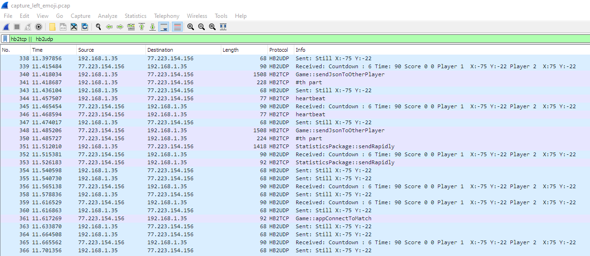
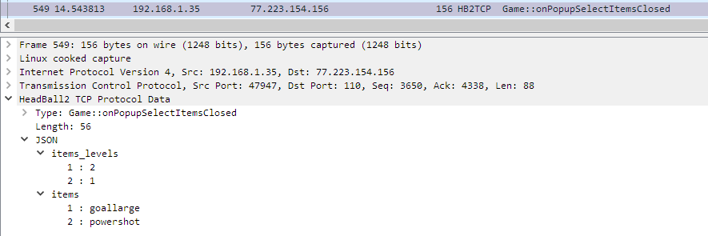
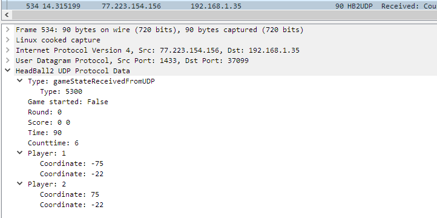
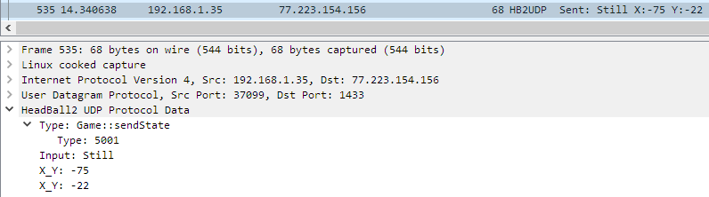

# wireshark dissector for mobile game 'headball 2'

## files
- json.lua -> for json parsing
- hb2.lua -> for dissecting tcp & udp packets

put files in `Wireshark->About->Folder->Global lua Plugins`

## pcap
- open game
- adb shell tcpdump -i any -p -s 0 -w /sdcard/capture.pcap
- adb pull /sdcard/capture.pcap capture.pcap
- open wireshark -> capture.pcap
## filters

### udp
- hb2udp
- hb2udp.type
- hb2udp.type_int
- hb2udp.score
- hb2udp.score
- hb2udp.gamestarted
- hb2udp.round
- hb2udp.time
- hb2udp.input
- hb2udp.x_y
- hb2udp.player
- hb2udp.data

### tcp
- hb2tcp
- hb2tcp.type
- hb2tcp.second_packet
- hb2tcp.type_int
- hb2tcp.len
- hb2tcp.unknown
- hb2tcp.data
- hb2tcp.json

### pics

